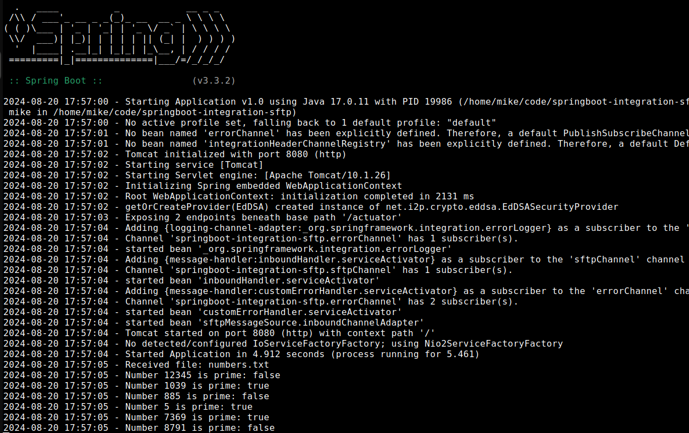

Spring Boot Integration SFTP
--

### Code repository
<a href="https://github.com/bmike2047/springboot-integration-sftp">https://github.com/bmike2047/springboot-integration-sftp</a>

### Description
This project is an example of using Spring Boot with Spring integration and SFTP. <br/>
An inbound channel adapter will connect to a SFTP server configured in application.properties.<br/>
It will download all remote files and in our example it expects the files to contain a list of numbers separated by a line break.<br/>
Each number line will be processed and check if the number is a prime.<br/> 
If success the line will be logged if not an error will be thrown and the channel adapter poller will process the file again after sftp-poller-delay defined in application.properties.<br/>
Some design notes:
* SFTP connection is done via caching session, and it will maintain permanent open connections. Testing of stale sessions is enabled.<br/>
* SFTP connection security is done via private key and known hosts file.<br/>
* Remote file synchronisation is done only once/file via SftpPersistentAcceptOnceFileListFilter. In case of failure the file is removed automatically from the filter's memory so a new retry will be possible on the next polling.<br/>
* A remote file will be copied into a local file as a processing fail-over strategy. 
* Local file processing is done only once/file via AcceptOnceFileListFilter, and it will be deleted in case of success by Pseudo Transaction Manager configured inside SftpAdapter.java. In case of failure the local file will be processed again on the next polling.<br/>
* Testing is done via an embedded Apache Mina sshd server.<br/>
* Docker project for SFTP server is provided to simulate a Production environment 

### Features
* Automatically reconnect and retry in case of network failure.<br/>
* Recovery from catastrophic or processing failure via local file storage and Transaction Manager.<br/>
* Send any errors from errorChannel to the provided health-check via Spring Actuator.<br/>
* Health-check is secured via Spring Security.<br/>

### Usage
Requires JDK 17<br/>
To simulate a production SFTP server (if you don't have one already configured) the project provides a docker setup inside the ./docker folder.<br/>
Upload file(s): docker/sftp1/upload/numbers.txt <br/>
To run the project:<br/>
```
cd springboot-integration-sftp
docker-compose -f docker/docker-compose.yml build && docker-compose -f docker/docker-compose.yml up
./gradlew bootJar && java -jar build/libs/springboot-integration-sftp-1.0.jar
```
To run the tests use the following gradle task:<br/>
```
./gradlew clean test
```
> [!Note]
> Testing is done with the provided embedded Apache Mina sshd server.<br/>
> Since both Apache Mina and the docker SFTP provided above use the same SFTP port (2222) you might want to stop the docker container when running the test task<br/>

> [!TIP]
> Health-check can be accessed via: http://localhost:8080/actuator/health/application<br/>
> In case any Load Balancer will need to check if the application si alive this endpoint will return an HTTP 200 OK no matter the file processing status: http://localhost:8080/actuator/info<br/>

> [!TIP]
> I case you have older JDK version than JDK 17 and you are using IntelliJIDEA as IDE make sure Gradle JVM is set to JDK 17 in:<br/>
> File | Settings | Build, Execution, Deployment | Build Tools | Gradle  -> Gradle JVM

### Screenshot

